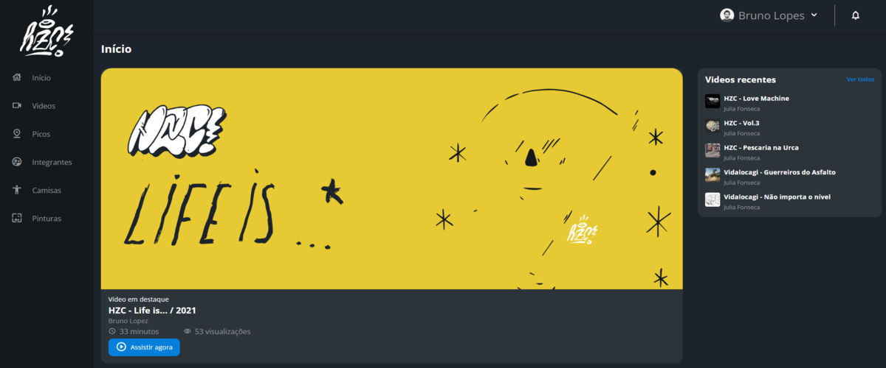

<h1 align="center" font-size="30px">Alura HZC :brazil:</h1>

Este projeto foi feito com intuito de aprender e praticar flexbox e grid layouts.

Nota: Projeto não finalizado. Subpáginas ainda não desenvolvidas.

| 🪧 Vitrine.Dev  |     |
| -------------- | --- |
| ✨ Nome        | **Alura HZC** |
| 🏷️ Tecnologias | HTML, CSS e Javascript |
| 🚀 URL         | [**Acesse o site**](https://ramoscarloseduardo.github.io/Alura-HZC/) |
| 🔥 Desafio     | [**Protótipo no Figma**](https://www.figma.com/file/ibWktwVpnog76rMYOdVhks/Dispondo-elementos-com-flexbox-e-grid?node-id=54%3A2358) |

<h1 align="center" font-size="30px">Alura HZC :us:</h1>

This project was made for practice and learning flexbox and grid layouts.

Note: Project unfinished. Subpages not made yet.

| 🪧 Vitrine.Dev  |     |
| -------------- | --- |
| ✨ Name        | **Alura HZC** |
| 🏷️ Technologies | HTML, CSS e Javascript  |
| 🚀 URL         | [**Go to the website**](https://ramoscarloseduardo.github.io/Alura-HZC/) |
| 🔥 Challenge     | [**Figma's prototype**](https://www.figma.com/file/ibWktwVpnog76rMYOdVhks/Dispondo-elementos-com-flexbox-e-grid?node-id=54%3A2358) |

